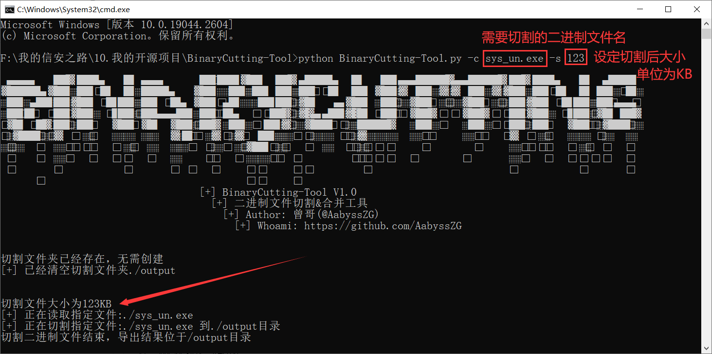
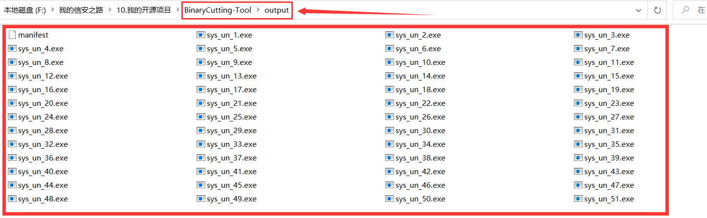
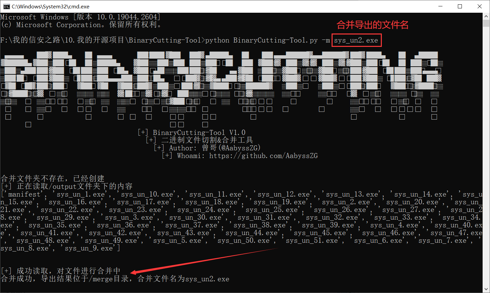
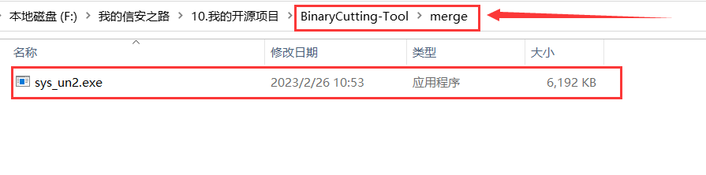

# ✈️ 一、工具概述
日常渗透过程中，有时候会碰到WebShell无法上传大文件，又不能远程下载exe的情况，这时候就需要一款二进制文件切割工具。

于是，就写了这么一个工具：BinaryCutting-Tool

# 🚨 二、安装Python依赖库
```
pip3 install filesplit
```

# 🐉 三、工具使用
```
# python3 BinaryCutting-Tool.py

 ▄▄▄▄    ██▓ ███▄    █  ▄▄▄       ██▀███ ▓██   ██▓ ▄████▄   █    ██ ▄▄▄█████▓▄▄▄█████▓ ██▓ ███▄    █   ▄████
▓█████▄ ▓██▒ ██ ▀█   █ ▒████▄    ▓██ ▒ ██▒▒██  ██▒▒██▀ ▀█   ██  ▓██▒▓  ██▒ ▓▒▓  ██▒ ▓▒▓██▒ ██ ▀█   █  ██▒ ▀█▒
▒██▒ ▄██▒██▒▓██  ▀█ ██▒▒██  ▀█▄  ▓██ ░▄█ ▒ ▒██ ██░▒▓█    ▄ ▓██  ▒██░▒ ▓██░ ▒░▒ ▓██░ ▒░▒██▒▓██  ▀█ ██▒▒██░▄▄▄░
▒██░█▀  ░██░▓██▒  ▐▌██▒░██▄▄▄▄██ ▒██▀▀█▄   ░ ▐██▓░▒▓▓▄ ▄██▒▓▓█  ░██░░ ▓██▓ ░ ░ ▓██▓ ░ ░██░▓██▒  ▐▌██▒░▓█  ██▓
░▓█  ▀█▓░██░▒██░   ▓██░ ▓█   ▓██▒░██▓ ▒██▒ ░ ██▒▓░▒ ▓███▀ ░▒▒█████▓   ▒██▒ ░   ▒██▒ ░ ░██░▒██░   ▓██░░▒▓███▀▒
░▒▓███▀▒░▓  ░ ▒░   ▒ ▒  ▒▒   ▓▒█░░ ▒▓ ░▒▓░  ██▒▒▒ ░ ░▒ ▒  ░░▒▓▒ ▒ ▒   ▒ ░░     ▒ ░░   ░▓  ░ ▒░   ▒ ▒  ░▒   ▒
▒░▒   ░  ▒ ░░ ░░   ░ ▒░  ▒   ▒▒ ░  ░▒ ░ ▒░▓██ ░▒░   ░  ▒   ░░▒░ ░ ░     ░        ░     ▒ ░░ ░░   ░ ▒░  ░   ░
 ░    ░  ▒ ░   ░   ░ ░   ░   ▒     ░░   ░ ▒ ▒ ░░  ░         ░░░ ░ ░   ░        ░       ▒ ░   ░   ░ ░ ░ ░   ░
 ░       ░           ░       ░  ░   ░     ░ ░     ░ ░         ░                        ░           ░       ░
      ░                                   ░ ░     ░
                                  [+] BinaryCutting-Tool V1.0
                                    [+] 二进制文件切割&合并工具
                                      [+] Author: 曾哥(@AabyssZG)
                                        [+] Whoami: https://github.com/AabyssZG

usage: BinaryCutting-Tool.py [-h] [-c CUTTING] [-m MERGER] [-s SIZE]

BinaryCutting-Tool V1.0

optional arguments:
  -h, --help  show this help message and exit
  -c CUTTING  切割目标二进制文件并导出
  -m MERGER   合并切割后的文件并导出
  -s SIZE     设定切割文件大小，默认1024KB
```

# 🛸 四、工具演示
## 1# 切割二进制文件
使用BinaryCutting-Tool进行切割：
```
python BinaryCutting-Tool.py -c sys_un.exe -s 123
```



导出文件夹内容如下：



## 2# 合并切割后的二进制文件
**切割完成后，可以上传至WebShell管理的站点上，这时候可以用系统命令进行合并：**

Windows：
```
copy 文件1 + 文件2 + 文件3...  导出的文件名
```

Linux：
```
cat 文件1 文件2 文件3... > 导出的文件名
```

也可以使用BinaryCutting-Tool进行合并：
```
python BinaryCutting-Tool.py -m sys_un2.exe
```



导出文件夹内容如下：


